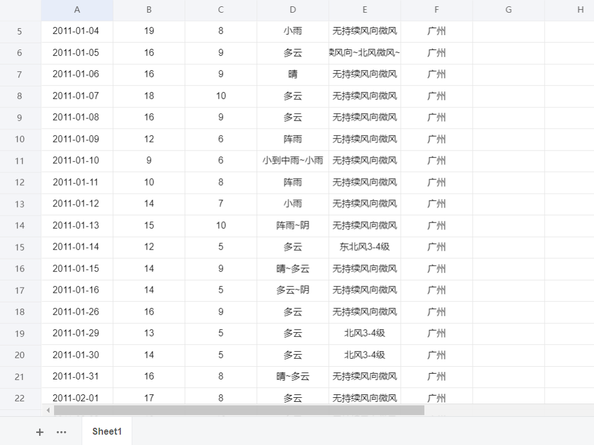
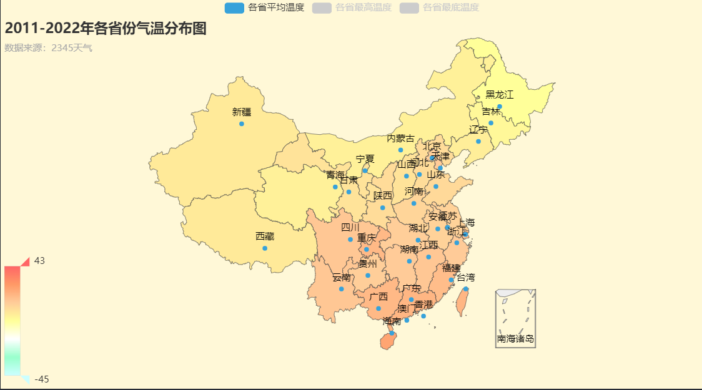
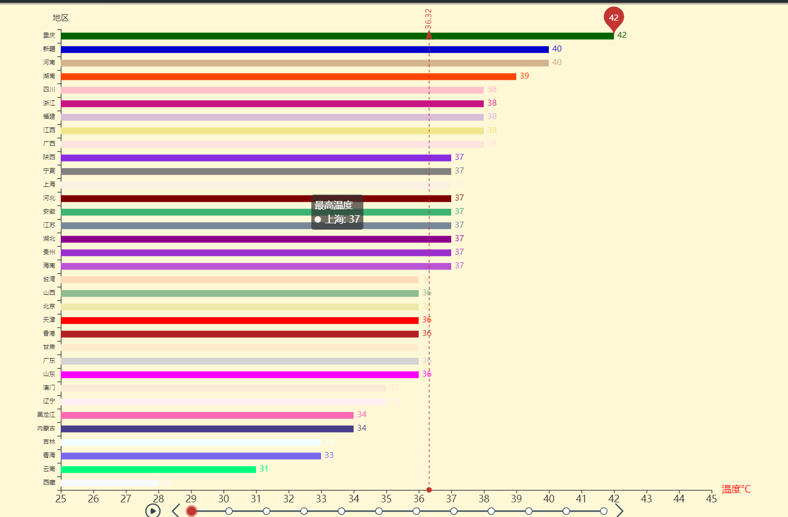
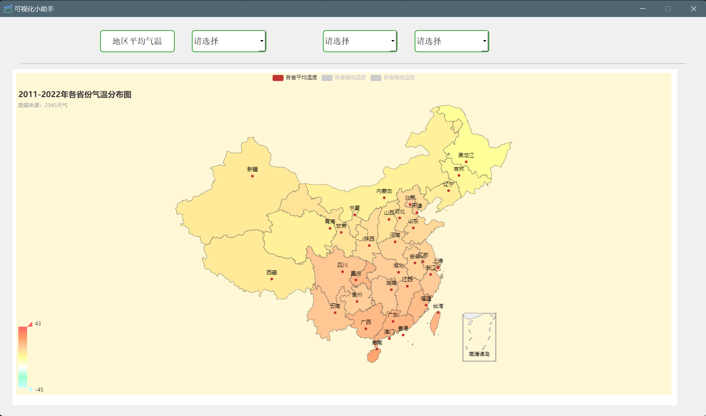
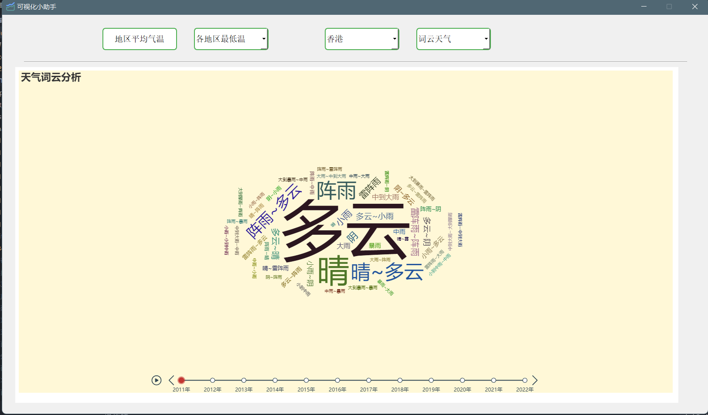

### 爬取2345历史天气

## 📣 简介

爬取2345天气并进行数据分析，将分析出的结果进行可视化，可以选择GUI应用选择地区可视化，也可以 jupyter notebook进行直接可视化

## ✨ 特性

* 此项目爬取了2345历史天气，并制作可视化交互图，制作了可视化助手，可以傻瓜式选择地区可视化。
* 时间跨度：(今年 - 11-> 今年 ) 一共12年，会自动爬取到最新的历史时间，也就是昨天的天气
* 技术栈：爬虫，数据分析：pandas，numpy，数据可视化：pyecharts， GUI图形应用：pyside2，多线程：简单的线程自动调度
* 运行流程：启动多线程 -> 线程调用爬取函数 ->爬取到的数据 ->存储到csv文件 ->数据分析

## 🔰 使用 & 说明

* 配置文件<config.py> 中可以自己调节、修改、删除 需要的参数，再此文件中可以修改城市code、省份、爬取的url、user-agent、地区：1为国际， 2，为中国、
  <<<<<<< HEAD
* 运行 <2345histroy_weather.py> 爬取历史天气，进程池会根据爬取的省的数量自动调节线程数量，线程数==爬取省份数，会在本目录下生成以每个省份命名的csv文件，数据的结构如下图 
* ipynb 文件都是数据可视化的交互动态图，运行时会读取本目录下的csv文件进行数据分析如下图, 更多效果图在image文件夹中(此处展示为静态图，实际为可交互动态图)
* 可视化助手：运行main.py即可，功能可以选择对应的分析图与对应的地区进行可视化分析，其中运行时有几率会卡住一会，因为涉及到大量的io操作以及数据清洗与处理，等10多秒即可。
* 还有就是可视化助手后面两个按钮，一定先要选择地区(第三按钮)，才可以选择图形(第四按钮)

第一次写的时候没保存，哎~~  ಠ_ಠ ` `
=========================================

* 运行 <2345histroy_weather.py> 爬取历史天气，进程池会根据爬取的省的数量自动调节线程数量，线程数==爬取省份数，会在本目录下生成以每个省份命名的csv文件，数据的结构如下图   
* ipynb 文件都是数据可视化的交互动态图，运行时会读取本目录下的csv文件进行数据分析如下图, 更多效果图在image文件夹中(此处展示为静态图，实际为可交互动态图)   
* 可视化助手：运行main.py即可，功能可以选择对应的分析图与对应的地区进行可视化分析，其中运行时有几率会卡住一会，因为涉及到大量的io操作以及数据清洗与处理，等10多秒即可。   
* 还有就是可视化助手后面两个按钮，一定先要选择地区(第三按钮)，才可以选择图形(第四按钮)

第一次写的时候没保存，哎~~  ಠ_ಠ  

记录一下吧！感觉以前好多代码烂在硬盘里了, 找不到了，不写文档年久失修咯
